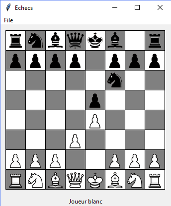
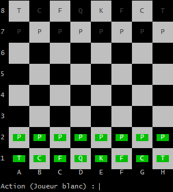
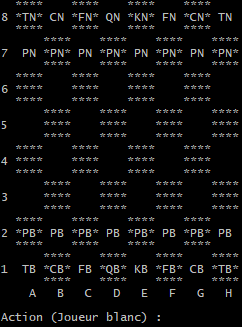

This program is a chess game coded in python 3.
It gives the possibility to play with 2 players.

Current functionalities developed:
- Move of all the pieces
- Check chess and mate
- Possibility to save/ load/ reset a game
- Roque
- Promotion
- Prise en passant
- Play through network
- Undo possibility

The chessboard looks like the following for each possible interfaces:

Windows interface:

python chess_main.py tkinter

Linux interface:

python chess_main.py linux

Simple interface:

python chess_main.py simple

Missing functionalities:
- IA to play alone
- Export of the game in formatting

